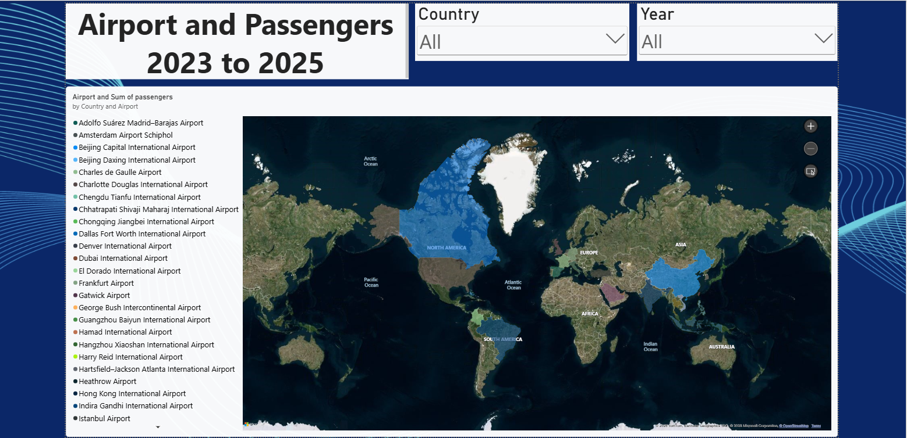

# ✈️ Airport and Passengers Map Dashboard

Power BI dashboard analyzing airport locations and passenger data from 2023 to 2025.

## 📌 Project Overview

This project focuses on analyzing airport and passenger data using Power BI.

The dashboard uses an interactive map to visualize airport locations and passenger volumes across different countries.

The dashboard also includes interactive filters for Year and Country to explore the data.

## 🛠️ Tools & Technologies

- Power BI
- Filled Map
- Slicers
- Data Visualization
- Interactive Filtering
- Tooltips
- Map Analysis

## 📈 Analysis

The dashboard focuses on the following key areas:

- Airport Locations
- Passenger Volume
- Country Analysis
- Yearly Analysis
- Geographic Data Visualization
- Interactive Map Analysis

## 🖥️ Dashboard Preview

## 🎛️ Dashboard Features

- Interactive geographic map
- Airport visualization
- Passenger volume analysis
- Year slicer
- Country slicer
- Map zoom controls
- Lasso selection
- Interactive tooltips
- Filtering across the dashboard

## 📊 Data Coverage

- 2023
- 2024
- 2025

The dataset includes information related to:

- Airport
- Country
- Location
- Passengers
- Year

## 🎯 Project Objective

The objective of this project is to visualize airport and passenger data geographically and provide an interactive way to explore passenger volumes across countries and years.

## 🧠 Skills Demonstrated

- Power BI Dashboard Development
- Data Visualization
- Geographic Data Analysis
- Interactive Filtering
- Map Visualization
- Dashboard Design
- Business Data Analysis
